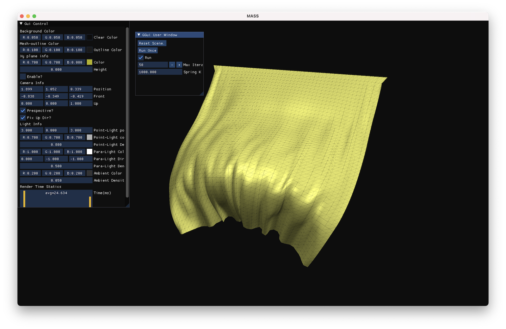
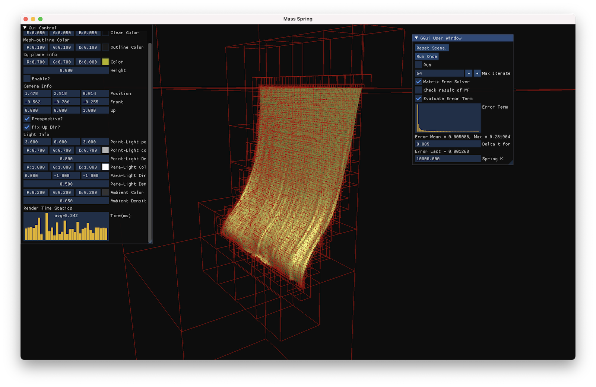

# Adversarr's Computer Graphics toolbox

NOTE: This project is highly expremental.

ACG is a toolbox designed for study use mainly about Physical Simulation, but not Rendering.

## Why yet another Computer Graphics Tool?

Although we have seen a huge number of libraries designed for CG, (and in many areas):

1. libigl: designed for geometry processing, the header-only coding style just leads to long compile time. The types of objects that igl-viewer can render is limitted.
2. Taichi: GPU-based Parallel computing library, designed for Physical Simulation. Taichi is originally a community-driven project, and lacks **Debugger** support, and exception support.

> On my macbook with Apple's Silicon, Taichi's crash will leads to OS's crash.

## Project Structure 

1. Core:
   1. General Utilities:
      1. `log`: based on SPDLOG
      2. `god`: a meta programming library for Compile Time Computing
      3. `json`: import nlohmann json.
      4. lots of tiny staff: such as `Result<T>`, unified & cross-platform time module, etc.

   2. Init: Hookers for global variables designed for shared/static libraries.
   3. Mathematics Tools: Import `Eigen`, and defines some types, such as `Field`, `TriangleList`.
   4. Parallel computing tools: Import `Taskflow`
   5. SAD(Static Auto Diff): a high performance and highly optimized **compile-time** AutoDiff Library.
   6. …

2. Gui:
   - (Finished) Scene visualization: Support Mesh(including instancing), Particles, and Wireframe.
   - (Finished) ImGUI & Vulkan based. high performance
   - (Finished) ImGUI based User Interface, and User Callback.
   - (Finished) Perspective/Ortho projection modes. (for 2D data-visualization, similar to Unity2d's design.)
   - Scene Editing/Storaging/...
3. Port: Data import module.
4. Plugins (not implemented)
   - libigl/cgal/... integration.
5. Examples, see below.

## Examples

This repo is designed for study use. Some implemented (just demos, not optimized, debugged) algorithms are listed below:

### mass_spring

mass-spring system based on Projective Dynamics. Refer to "Fast mass spring" by Tiantian Liu.

and this provides an bonus solver, which applies a single step of Jacobi method on PD, which leads to real-time simulation of traditional mass-spring at about 30fps (on my laptop).

Now, mass spring will also show the dynamic computed grid (SubdivisonAABB) for further Broad Phase CCD app.

### fem-implicit

Quasi Newton solver.

### Other Stuffs

1. `fem-implicit`: first-order explicit integrator. NeoHookean or StVK FEM Soft Body Simulation.
2. `mpm-explicit`: PIC-Fluid simulation, toy P2G and G2P process, weakly-compressible.

