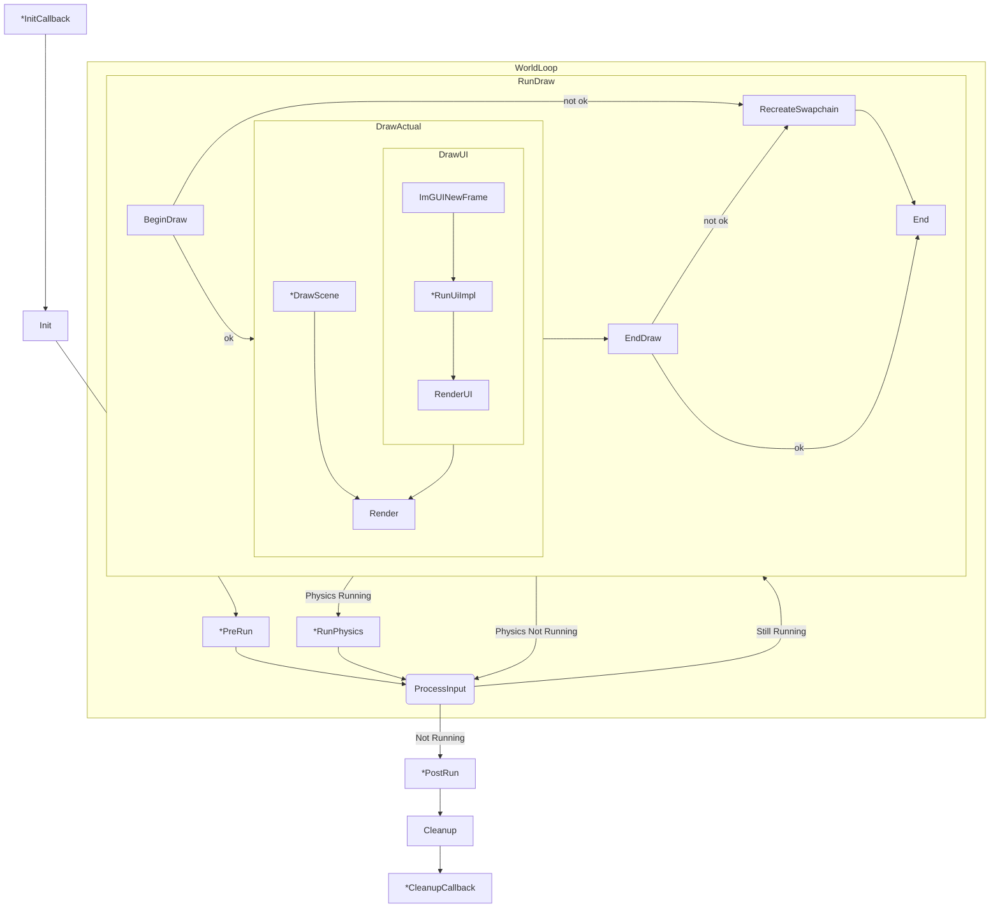

## Render Loop Graph

Following mermaid flowchart illustrates.

```mermaid
flowchart
  *InitCallback-->Init-->*PreRun
  *PostRun-->Cleanup-->*CleanupCallback
  ProcessIO-- Not Running --> *PostRun
  subgraph WorldLoop
    *PreRun-->ProcessIO(ProcessInput)
    ProcessIO -- Still Running --> RunDraw
    RunDraw-- Physics Running --> *RunPhysics --> ProcessIO
    RunDraw-- Physics Not Running --> ProcessIO
    subgraph RunDraw
    	BeginDraw -- ok --> DrawActual
    	BeginDraw -- not ok --> RecreateSwapchain -->End
    	subgraph DrawActual
        subgraph DrawUI
          ImGUINewFrame-->*RunUiImpl-->RenderUI
        end
        *DrawScene --> Render
        DrawUI --> Render
    	end
    	DrawActual --> EndDraw
    	EndDraw -- ok --> End
    	EndDraw -- not ok --> RecreateSwapchain
    end
  end
```

