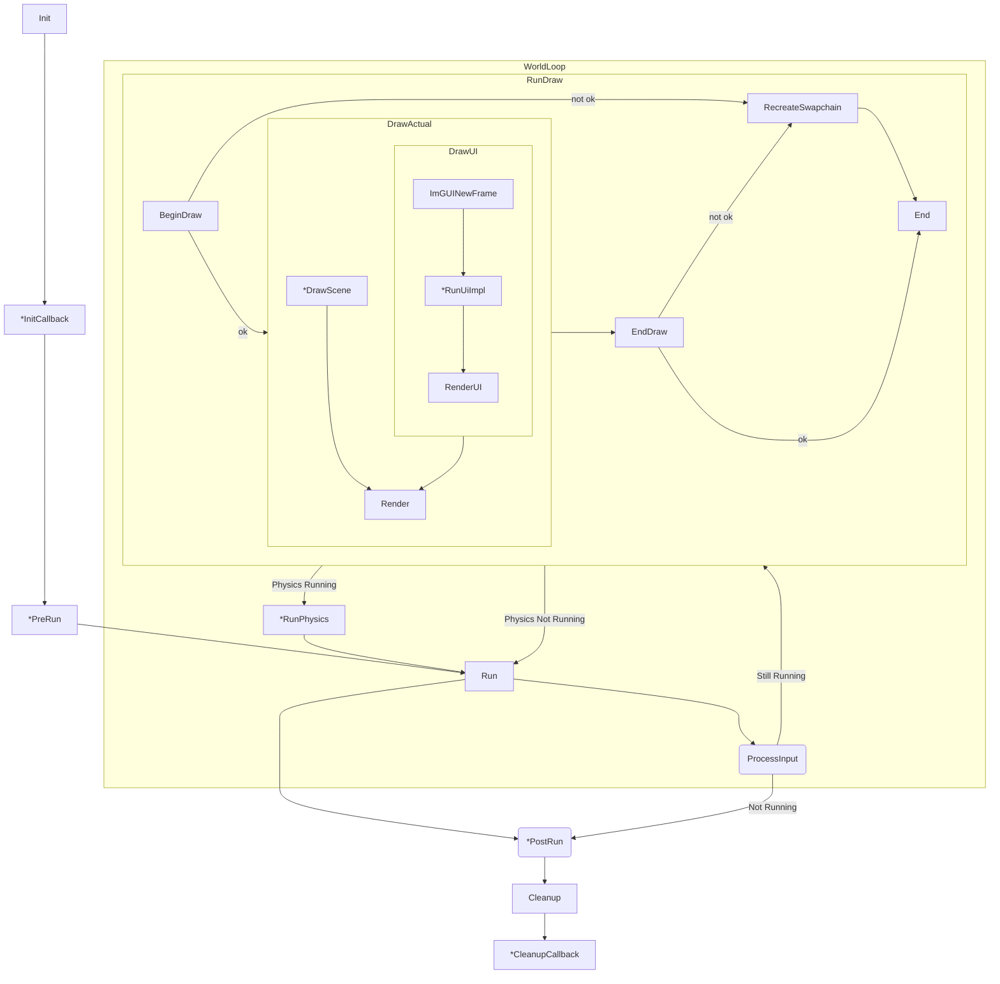

## Render Loop Graph

### Synced Rendering

```mermaid
flowchart
  Init-->*InitCallback-->*PreRun-->Run-->PostRun(*PostRun)-->Cleanup-->*CleanupCallback
  ProcessIO-- Not Running --> PostRun
  subgraph WorldLoop
    Run--->ProcessIO(ProcessInput)
    ProcessIO -- Still Running --> RunDraw
    RunDraw-- Physics Running --> *RunPhysics --> Run
    RunDraw-- Physics Not Running --> Run
    subgraph RunDraw
    	BeginDraw -- ok --> DrawActual
    	BeginDraw -- not ok --> RecreateSwapchain -->End
    	subgraph DrawActual
        subgraph DrawUI
          ImGUINewFrame-->*RunUiImpl-->RenderUI
        end
        *DrawScene --> Render
        DrawUI --> Render
    	end
    	DrawActual --> EndDraw
    	EndDraw -- ok --> End
    	EndDraw -- not ok --> RecreateSwapchain
    end
  end
```
